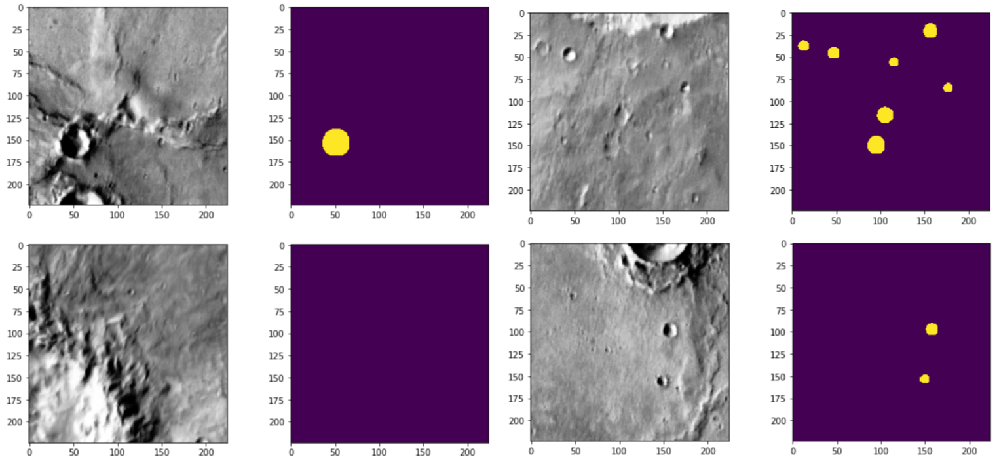
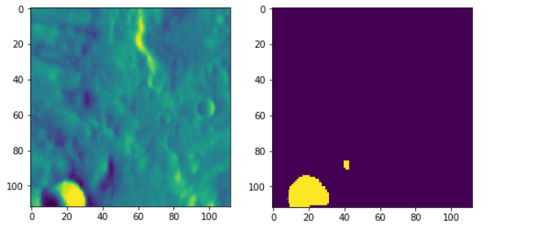
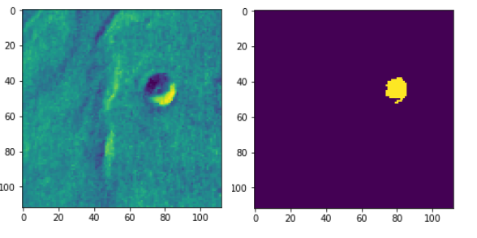
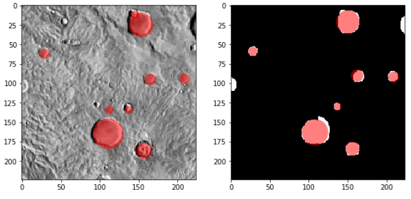
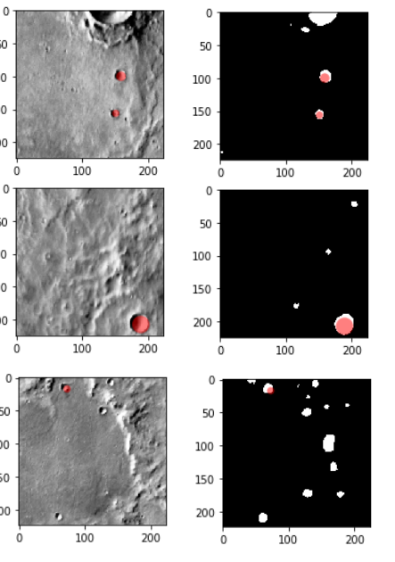
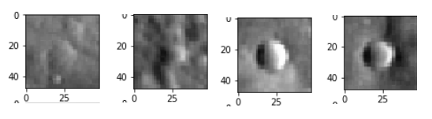
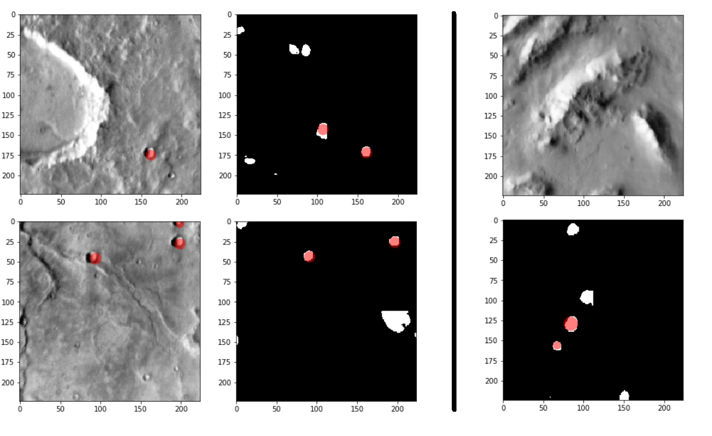

# Mars-Craters
Mars Craters Detection using Mask and Image Classification

### Key points :

**1. Use of U-Net algorithm** to get the mask of an image ie a segmented image of same size

   

Mask Prediction :

  
   

**2. Detection on the mask of circles with circular Hough transform**

   

However, using mask has some drawbacks : for instances, two many white area might lead to a presumed cicle :

   

**Idea** : applying a classification (similarly used in sliding-windows method) in order to improve precision on detected circles. It will sort presumed circles obtained with the mask to add a confidence score.

**classification model** trained on smaller images, which can be either craters or random parts of the surface of mars.

   

**3. Combination of both mask and classification :**

   

